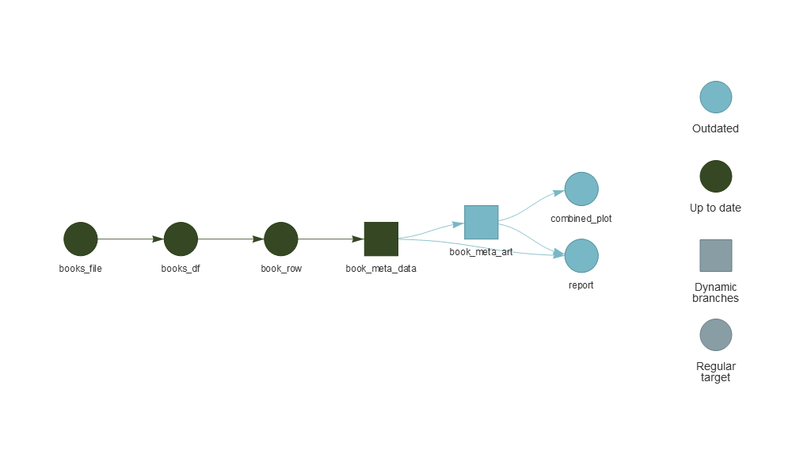
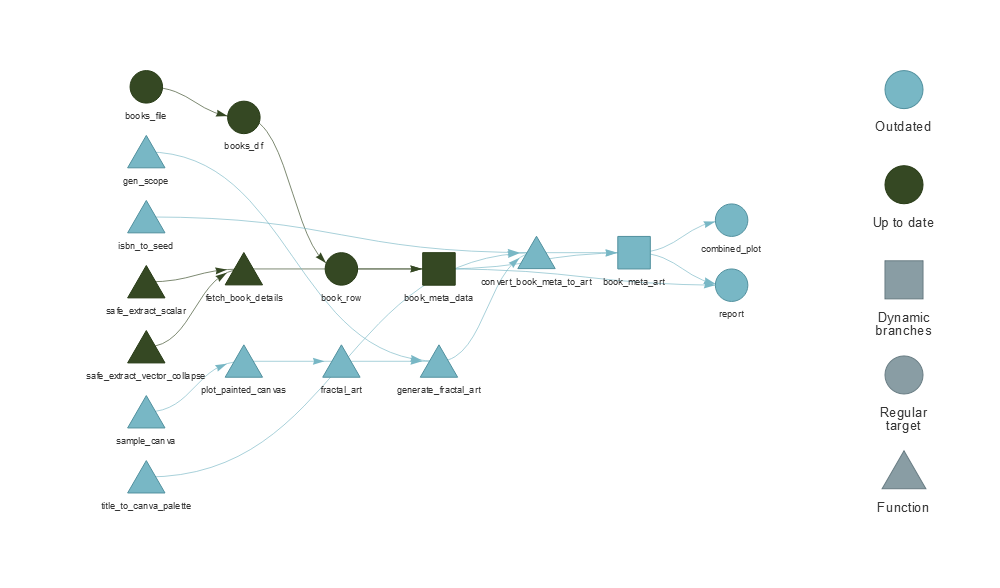

Brief Targets Guide
================

<!-- README.md is generated from README.Rmd. Please edit that file -->
<!-- badges: start -->
<!-- badges: end -->

# Intro

This R Tech Talk will be a brief overview of the [Target
package](https://books.ropensci.org/targets/) with a worked example.

If you just want the art go [here](R/fractals.R), copy/paste script,
uncomment library calls and the function call
“generate_fractal_art(pixels = 200)” at line 111, install packages if
necessary and source the script 🤞 no promises that it’ll work.

# What and Why

At its core Targets aims to make anything code related easier and faster
to manage, fix, share and run. It is a pipeline tool, which means it
orchestrates and runs the steps involved in analysis projects.It avoids
the rerunning of computational intensive pieces of code (i.e saves
time). Tracking of dependencies/steps/stages are in built by design.

# How

Think of a script based workflow. May have steps/stages split up across
multiple scripts and potentially a master script which runs the overall
workflow. In certain cases when issues come up large swathes of the code
needs to be rerun(time consuming). Ability to understand the knock on
effects of changes may also be difficult.

Targets is a **function oriented workflow** where the overall workflow
is composed of functions. An orchestrating file **\_target.R** outlines
a recipe/plan on how these functions integrate to produce the workflow.
Under the hood the plan is actually a graph which monitors the inputs
and outputs from steps(functions) in the workflow. From this plan
targets can track changes to inputs e.g(datasets) and the code itself.
The entire workflow is run. After an initial run, subsequent reruns only
make updates depending on if changes have been made to their inputs and
or code.

# Vocabulary

Within a targets workflow are targets. Think of them as steps in a
workflow, a function takes in an input(preexisting target or raw input
file) and produces an output(generally an rds object) which can be used
in subsequent steps/targets. Also think of them as variables

# Dependency Tracking

The graph below depicts the target workflow, using this we can see what
dependencies exist. For example we can quickly identify what downstream
steps may be affected by altering function code or changing data inputs.

## Visualization of datasets/targets in the workflow

### Targets Only

    #> + book_meta_data declared [8 branches]
    #> + book_meta_art declared [8 branches]

<!-- -->

### Functions and Targets

    #> + book_meta_data declared [8 branches]
    #> + book_meta_art declared [8 branches]

<!-- -->

# Running Targets Workflow

``` r
targets::tar_make()
```

This function runs an entire workflow stopping if an error occurs (can
be set to ignore, lots of customization via parameters). It makes
updates to the targets depending on if their preceding targets have been
changed.

The below function returns a data frame containing any warnings which
were produced by the targets

``` r
targets::tar_meta(fields = warnings, complete_only = TRUE)
```

tar_read() nad tar_load() provide access to the outputs produced

``` r


obj <- targets::tar_read(name_target) ## read name_target to variable obj

targets::tar_load(name_target)## load name_target into environemnt 
```

# Some Notes

- Different approach to working will be strange to some.
- A learning curve but not as steep as you think.
- Highly thought of package within the R community
- Github discussions very active and likely has solution to a problem
- Complications arise when using targets in workbench specifically with
  CSO drive system. However solutions exist.
- The bookapi doesn’t work on workbench but does work on local
  installation
- Targets can be used with databases, however you have to get creative
  in how you’ll track changes to the database to avoid needless
  rerunning. This may help
  [tar_change](https://docs.ropensci.org/tarchetypes/reference/tar_change.html?q=tar_change).
  An example is a database table with a date column, a target is set to
  always run. It checks the most recent date in the table, if it changes
  a subsequent process returns the table(e.g DBI or tbl()) if not it
  skips the subsequent step. Obviously you can alter the checking target
  so it only considers the changes in a database which are relevant to
  you. Potential to hash a table in a database and track the hashes,
  however need to consider if that process actually saves time or adds
  more.

# Resources

- [Target package User Manual](https://books.ropensci.org/targets/)
- [Walkthrough](https://carpentries-incubator.github.io/targets-workshop/aio.html)
- [Github Discussions](https://github.com/ropensci/targets/discussions)
- [Brilliant Blog unfortunately Blocked on CSO
  Network](https://blog.djnavarro.net/)

# (Ignore unless Considering implementing a project using Targets)

- The normal target setup breaks when having a project setup on the file
  drive network while using the workbench server. Targets is fine when
  using the space each user has on workbench i.e your local space.There
  is a solution.

- Targets workflow writes data and then reads quickly from said data. On
  the server this process caused fundamental issues where data reads
  occurred before writes were completed (something along those lines).
  Need a way to explicitly wait for data to be available before reading
  from it. After scouring targets documentation [CAS(content-addressable
  storage)](https://docs.ropensci.org/targets/reference/tar_repository_cas.html)
  proved a solution. In short it augments and or replaces the
   \_targets objects system.

The **\_targets.R** script changes slightly where a global option is
changed. The repository/storage used.

``` r

# Set target options
tar_option_set(packages = c("DBI", "odbc", "dplyr", "lubridate", 'tidyr', 'stringr', 'httr2', "validate","knitr"),
               repository = tar_repository_cas_local() ## Added for rserver due to issues with reading and writing from shared drive
               )


# tar_repository_cas_local()  is the default CAS system provided but one can develop their own.
```

However each target can be individually changed to use a different
repository. This is necessary when using targets which track files e.g
csv. In such case we want the target to resort to the old traditional
repository/storage. This is necessary as CAS unfortunately deletes files
once they have been integrated/read into the pipeline.

``` r

# tar_file_read both tracks a file and reads it
# For this target we dont use CAS repository instead make it use the traditional local approach
tar_file_read(pig_factory_look_up,"confidential/pig_factory_look_up.csv", read.csv(!!.x),repository = 'local')
```
